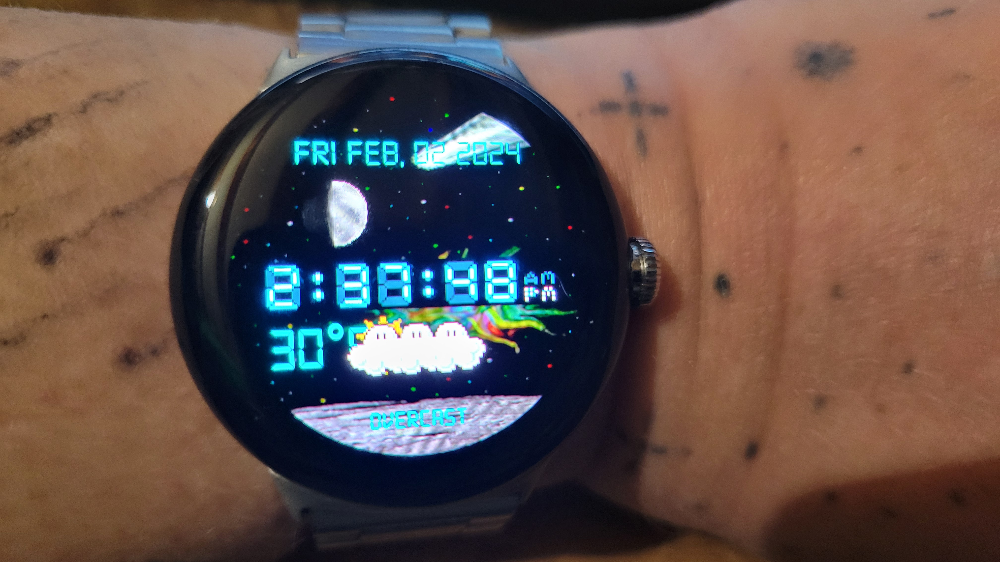

# Own-watchface-LEDs Stand Alone

# NOTE 
This watchface will not work on WearOS 5 because Google is forcing WatchFaceFormat.   
FUCK YOU TO GOOGLE!!!!   I prefer and needed to use code in kotlin for my favorite watchface.        
It will not work on pixel watch 3.  I am glad I do not spent $400 for this trash pixel watch 3   
I hate coding limits!!!!      FUCK YOU TO GOOGLE!!!!     

This have been my watchface for many years for my smart watches on Android Wear and Wear OS.
This watch face do not need phone to be connected and sending datas. 
This watch face require newer version of Wear OS. Tested on Google Pixel watch too.     

